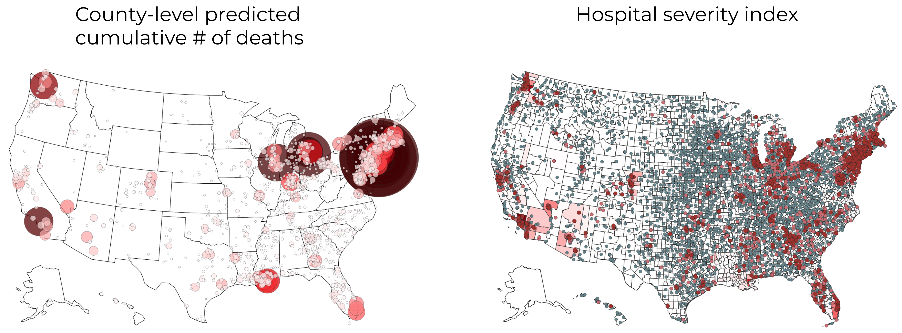

<h1 align="center">Covid Severity Forecasting</h1>

<p align="center">Data and models (updated daily) for forecasting COVID-19 severity for individual counties and hospitals in the US. The data includes confirmed cases/deaths, demographics, risk factors, social distancing data, and much more.
</p>

<p align="center">
  Table of contents </br>
  <a href="#overview">Overview</a> •
  <a href="#quickstart-with-the-data--models">Quickstart</a>
  </br> Resources </br>
  <a href="./data/county_data_abridged.csv">Data csv</a> •
  <a href="https://arxiv.org/abs/2005.07882">Paper</a> •

</p>

# Overview

*Note: This repo is actively maintained - for any questions, please file an issue.*

- **[Data](./data/readme.md)** (updated daily): We have cleaned, merged, and documented a large corpus of hospital- and county-level data from a variety of public sources to aid data science efforts to combat COVID-19.
    - At the hospital level, the data include the location of the hospital, the number of ICU beds, the total number of employees, the hospital type, and contact information
    - At the county level, our data include socioeconomic factors, social distancing scores, and COVID-19 cases/deaths from USA Facts and NYT
    - Easily downloadable as [processed csv](./data/county_data_abridged.csv) or full pipeline
    - Extensive documentation available [here](./data/list_of_columns.md)
- **[Paper link](https://arxiv.org/abs/2005.07882)**: "Curating a COVID-19 data repository and forecasting county-level death counts in the United States"
    - see [interactive county-level map](http://covidseverity.com/results/deaths.html) + [interactive hospital-level map](http://covidseverity.com/results/severity_map.html)

- **[Modeling](./modeling/readme.md)**: Using this data, we have developed a short-term (3-5 days) forecasting model for mortality at the county level. This model combines a county-specific exponential growth model and a shared exponential growth model through a weighted average, where the weights depend on past prediction accuracy.

- **Severity index**: The Covid pandemic severity index (CPSI) is designed to help aid the distribution of medical resources to hospitals. It takes on three values (3: High, 2: Medium, 1: Low), indicating the severity of the covid-19 outbreak for a hospital on a certain day. It is calculated in three steps.
    1. county-level predictions for number of deaths are modeled
    2. county-level predictions are allocated to hospitals within counties proportional the their total number of employees
    3. final value is decided by thresholding the number of cumulative predicted deaths for a hospital (=current recorded deaths + predicted future deaths)


# Quickstart with the data + models

Can download, load, and merge the data via:
```python
import load_data
# first time it runs, downloads and caches the data
df = load_data.load_county_level(data_dir='/path/to/data') 
```

- for more data details, see [./data/readme.md](./data/readme.md)
- see also the [quickstart notebook](quickstart.ipynb)
- we are constantly monitoring and adding new data sources (+ relevant data news [here](https://docs.google.com/document/d/1Gxfp-8NXHZN1Hre0CThx0sdO17vDOso640eK6MHlbiU/))
- output from running the daily updates is stored [here](./functions/update_test.log)

To get deaths predictions for our current best-performing model, the simplest way is to call the `add_preds` function (for more details, see [./modeling/readme.md](./modeling/readme.md))

```python
from modeling.fit_and_predict import add_preds
df = add_preds(df, NUM_DAYS_LIST=[1, 3, 5]) # adds keys like "Predicted Deaths 1-day", "Predicted Deaths 3-day"
# NUM_DAYS_LIST is list of number of days in the future to predict
```
